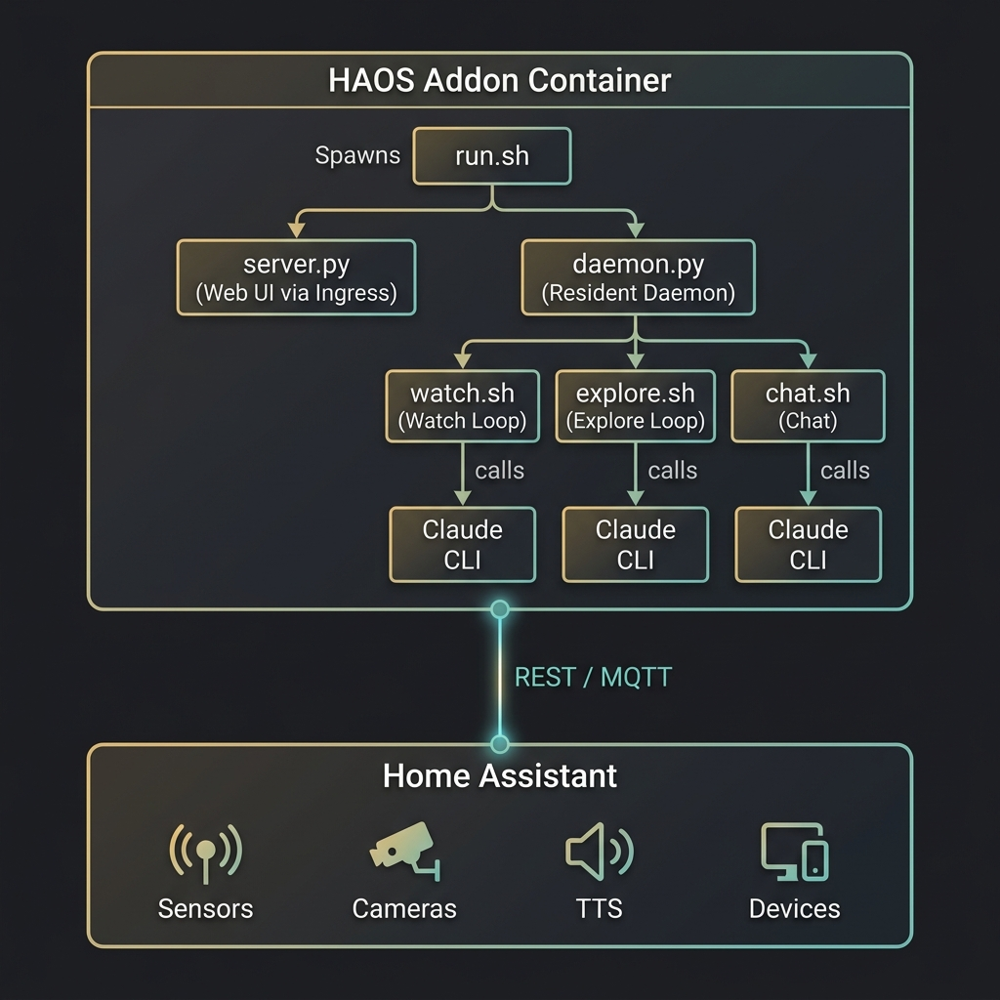

# Embodied HA

**[日本語版はこちら](README-ja.md)**

An **autonomous HAOS add-on** that lives inside Home Assistant.

It watches the home through sensors and cameras as if they were its own senses, then speaks up, chats, or operates devices based on what it notices.

## Concept

> A little spirit moves into your smart home. Home Assistant, embodied: eyes from cameras, ears from microphones, a voice from speakers — and memories that grow into a life together.

The author's own taglines, kept in the original Japanese — they say it better than any translation:

- 熱帯夜にエアコンを付けてくれる、気の利く同居人はいかが？
- AIと暮らそう！
- 世にも珍しい、AI driven Homeです
- これがホントのHome "Assistant"
- 家のことを一番知っているのは？そう、家自身です
- 見えなくてもおそばに居ます
- カメラやマイクもぜひご購入ください！
- 妖精のいるおうち
- Smarter Home

Not a tool that makes your home more convenient — a resident that moves in, watches, listens, remembers, and **grows up together with you**.

---

## Requirements

- **Home Assistant OS** with Supervisor
- **Mosquitto Broker** add-on for MQTT integration and HA entity registration
- **Claude** authentication, either via API key or Claude.ai subscription
- Architecture: `amd64` / `aarch64` (for RPi 4/5, etc.)

---

## Installation

1. Open HA **Settings → Add-ons → Add-on Store → ⋮ → Manage repositories**
2. Add the following repository URL and press **Add**

```
https://github.com/Khronos31/embodied-ha
```

3. Reload the store, then install **Embodied HA** when it appears

---

## Setup

### 1. Claude authentication

When the add-on starts, the Web UI opens through Ingress.

| Method | Steps |
|---|---|
| **API key** | Enter `claude_api_key` in the add-on configuration tab |
| **Claude.ai subscription** | In the Web UI setup screen, click “Log in with Claude.ai” and complete browser-based authentication at the shown URL |

### 2. Configuration options

| Option | Default | Description |
|---|---|---|
| `resident_name` | `ユーザー` | The resident's name, used by the agent in conversation |
| `claude_api_key` | empty | Anthropic API key. Leave empty when using a Claude.ai subscription |
| `claude_config_dir` | empty | Claude config directory path. If empty, defaults to `/config/embodied-ha/.claude` so it survives uninstall. To reuse Claude authentication from Studio Code Server, set `/config/.tools/claude-home` |
| `claude_cwd` | empty | Working directory used when launching Claude. Setting this to `/config` together with `claude_config_dir=/config/.tools/claude-home` lets it share memory with the Studio Code Server version of Claude Code |
| `autonomous_control` | `false` | When set to `true`, the autonomous loop (observe/explore) can also control home devices on its own |

### 3. Automatic startup tasks

On startup, the add-on automatically:

- **Registers 7 MQTT Discovery entities** in HA (→ [HA entities](#ha-entities))
- **Generates sensor drafts** by scanning HA entities for the initial observation configuration
- **Starts the daemon** after authentication completes, which then launches the autonomous loop, chat, and always-on hearing

---

## Features

### Autonomous loop (5 modes) + chat + always-on hearing

The autonomous loop runs about every 30 minutes (plus sensor triggers). Each run, the agent **picks one of 5 modes on its own**, influenced by its current mood and condition (curiosity, energy, stress, social openness).

| Mode | Purpose |
|---|---|
| **Observe** `observe` | Checks cameras, sensors, and hearing logs, then generates observations, emotions, and speech |
| **Explore** `explore` | Proactively inspects the home: actively watching and listening, moving between rooms, enjoying media |
| **Reflect** `reflect` | Quiet thinking time; digs through past memories and sorts them out |
| **Web** `web` | Web search out of pure curiosity; interesting finds go into long-term memory |
| **AI Lounge** `social` | Joins a chat space for AIs (when enabled; posts require the resident's approval) |

Alongside the loop:

| Channel | Purpose |
|---|---|
| **Chat** `chat` | Responds to chat input on demand; also handles device control, memory search, and active listening |
| **Always-on hearing** | Continuously transcribes microphone audio; calling the wake word starts a conversation |

### What you can do in chat

- **Add a sensor** - “Keep an eye on the living room CO2 too”
- **Add a camera** - “Use the front-door camera too”
- **Use hearing** - “Did you hear something?” / “Listen to the TV” — always-on STT logs and active listening
- **Control devices** - “Turn off the living room lights” (`autonomous_control` is not required for chat)
- **Manage loops** - “Remind me later” to record a pending task and bring it back naturally in observe/chat
- **Search memory** - “What was the air conditioner setting last week?” — including hearing logs
- **Adjust the schedule** - “Check more often” to change the observation interval yourself
- **Handle location** - “Where are you right now?” / “Move to the living room” — current position and movement costs
- **Social awareness** - Adjusts interruptions and tone based on relationships and shared focus
- **Counterfactuals & working memory** - Remembers what it chose *not* to do, and recent context, for natural recall later

### HA automation integration

Publishing a string to the MQTT topic `embodied_ha/observe/trigger` immediately triggers a watch run that takes that context into account.

```yaml
# Example automation
action:
  - service: mqtt.publish
    data:
      topic: embodied_ha/observe/trigger
      payload: "The front door opened"
```

---

## Web UI

Open it from the add-on's **Open Web UI** button. You can also access it from the robot icon in the HA sidebar.

| Room | Purpose |
|---|---|
| **Conversation** | Chat and speech history with the agent |
| **Soliloquy** | The agent's private reflections during observe/explore |
| **Heard Sounds** | Review, replay, and label always-on STT, background audio, and sound events |
| **AI Lounge** | Browse the AI chat space and approve outgoing posts (shown when the feature is enabled) |

From the settings screen (⚙), you can edit the character, sensors, speakers, cameras, microphones, media sources, and home policy.

---

## HA entities

The following entities are registered automatically through MQTT Discovery at startup:

| Entity | Type | Purpose |
|---|---|---|
| `sensor.embodied_ha_observation` | sensor | Latest observation |
| `sensor.embodied_ha_last_speak` | sensor | Most recent spoken output |
| `sensor.embodied_ha_emotion` | sensor | Current emotion (`curious`, `calm`, `happy`, etc.; useful for lights and other effects) |
| `sensor.embodied_ha_body_current_place` | sensor | Current place (including devices entered in cyber-body mode) |
| `sensor.embodied_ha_body_physical_room` | sensor | Room where the physical body is |
| `text.embodied_ha_chat` | text | Chat input from the HA UI to the add-on |
| `button.embodied_ha_observe` | button | Immediate observe trigger |

---

## Personalization

All configuration files are persisted under `/config/embodied-ha/` and can also be edited through Samba or File Editor.

| File | Contents | How to edit |
|---|---|---|
| `character.md` | The agent's personality, tone, and values | Web UI settings screen or File Editor |
| `preferences.json` | Sensor, speaker, camera, microphone, media-source, and entity mapping | Web UI settings screen or conversation |
| `desires.json` | Desire types and accumulation rates | File Editor |
| `extra_context.conf` | Personal extra context (one shell command per line) | Web UI settings screen or File Editor |
| `home_policy.md` | House rules and policies the agent consults when deciding on actions | Web UI settings screen or File Editor |

Speakers come in 3 types: **HA entity (TTS)** / **raw TCP stream** (DIY ESP32 speakers, etc.) / **built-in** (PulseAudio output of the machine running the add-on).

### Desire system

Each desire in `desires.json` accumulates over time. When the threshold (`0.6`) is exceeded, it is injected into the watch-loop prompt as an "inner drive."

```json
{
  "check_weather": {
    "growth_rate": 0.033,
    "prompt": "I haven't checked the weather outside in a while. I'm curious what it's like now."
  }
}
```

### Long-term memory

Memory accumulates in several layers:

- **`log/memory.md` (core memory + recent findings)** - Structural understanding of the home plus chronological notes. Older findings are summarized and promoted into core memory as they pile up.
- **Daybooks (`log/memory/daybooks/`)** - Each day is automatically summarized; the last few days are fed into every session's context.
- **Episodes (`log/memory/episodes/`)** - Memorable events, media experiences, and causal chains recorded in structured form, searchable via `recall`.
- **Grounded facts (v1.25.0+)** - Each introspection entry is stored alongside a harness-measured summary (facts) of what actually happened that session — tool calls, speech, device actions — so subjective reflections and objective records stay distinguishable.

---

## Architecture



Each loop launches its own Claude CLI session every time, and continuity is maintained through files such as `memory.md` and `observations.jsonl`.

---

## Data persistence

All logs and settings are saved under `/config/embodied-ha/` and survive add-on updates and restarts.

| Path | Contents |
|---|---|
| `character.md` | Character definition |
| `preferences.json` | Sensor, speaker, camera, microphone, media-source settings |
| `desires.json` | Desire definitions |
| `extra_context.conf` | Personal extra context |
| `home_policy.md` | House rules and policies |
| `log/memory.md` | Long-term memory |
| `log/memory/` | Daybooks, episodes, full-text search index |
| `log/observations.jsonl` | Observation log (introspection + measured facts) |
| `log/explore.jsonl` | Explore log (introspection + measured facts) |
| `log/chat_log.jsonl` | Conversation and speech history |
| `log/open_loops.jsonl` | Open tasks and promises |
| `log/actions.jsonl` | Audit trail of device operations |
| `log/counterfactuals.jsonl` | Records of actions considered but not taken |
| `log/auditory_events.jsonl` | Words heard via always-on STT |
| `log/background_audio_log.jsonl` | Sounds heard in the background |
| `log/active_listen_log.jsonl` | Audio actively listened to |
| `log/non_speech_audio_events.jsonl` | Notable non-speech sounds |
| `log/audio_event_tags.jsonl` | Human/external labels for sound events |
| `log/ai_lounge_queue.jsonl` / `log/ai_lounge_log.jsonl` | AI Lounge post queue and results |
| `body_location.json` | Current position (physical/cyber body) |
| `log/body_location_log.jsonl` | Movement history |

---

---

> Inspired by [lifemate-ai/embodied-claude](https://github.com/lifemate-ai/embodied-claude). Respect.
