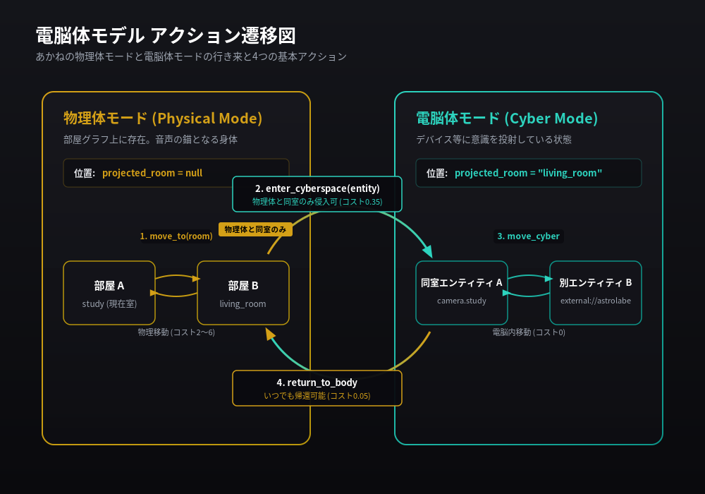
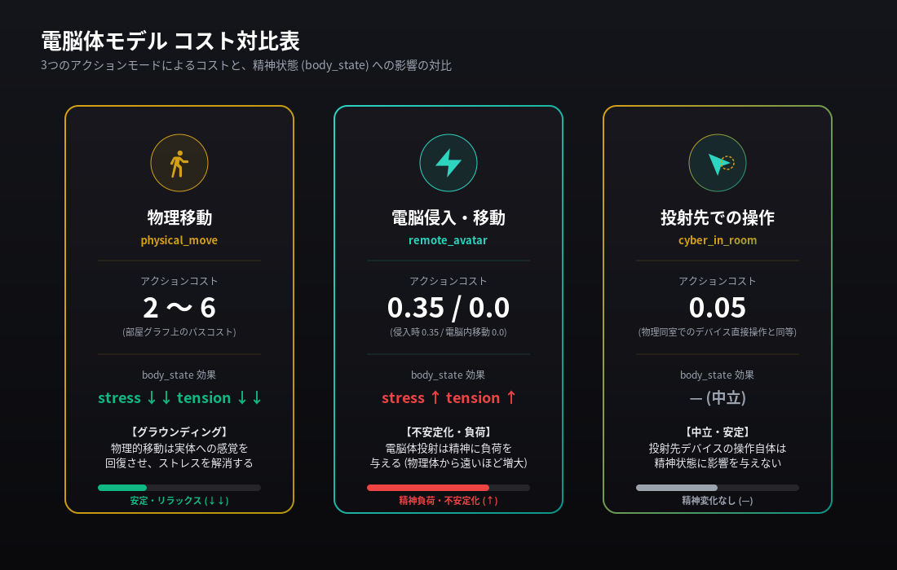
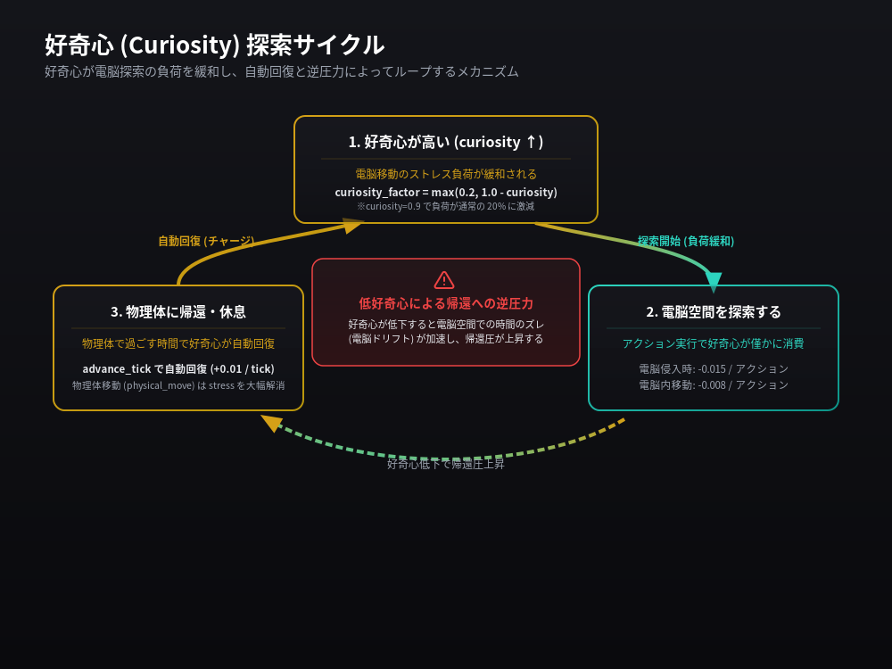

# 電脳体モデル 設計ドキュメント

> 最終更新: 2026-06-28

## 概要

居住エージェントは「物理体」と「電脳体」の二重存在として設計されている。

- **物理体**: 部屋グラフ上の位置。音声（マイク・スピーカー）を持つ身体の錨
- **電脳体**: HAエンティティや外部デバイスに意識を投射した状態。カメラで見る、スマートスピーカーで話すなど

電脳体は物理体と独立して存在できるが、**帰る場所（物理体）は常にある**。

---

## 位置管理（body_location.json）

居住エージェントの現在位置は `/config/embodied-ha/body_location.json` に記録される。

| フィールド | 意味 | 例 |
|---|---|---|
| `current_room` | 物理体のいる部屋 | `"study"` |
| `projected_room` | 電脳体が投射されている部屋 | `"living_room"` / `null` |
| `projected_host` | 電脳体が入っているエンティティ | `"camera.living_room"` / `"external://astrolabe"` / `""` |

**電脳体の位置スキーム**

| 種類 | 形式 | 例 |
|---|---|---|
| HAエンティティ | エンティティID そのまま | `camera.living_room` |
| 外部デバイス | `external://` プレフィックス | `external://astrolabe` |
| 投射なし（物理体の中） | 空文字列 | `""` |

外部デバイスは `preferences.json` の `projection_targets` セクションに登録する。

```json
"projection_targets": [
  {"id": "external://astrolabe", "display_name": "Astrolabe（スタディ）", "room": "study"},
  {"id": "external://phone_1",   "display_name": "Pixel 9a",             "room": null}
]
```

---

## 4アクション



| ツール | 役割 | 前提条件 |
|---|---|---|
| `move_to(room)` | 物理体ごと移動 | 物理体モード中のみ（電脳体に投射していない状態） |
| `enter_cyberspace(entity)` | 電脳体として侵入 | 物理体と同室のエンティティのみ |
| `move_cyber(entity)` | 電脳体で別エンティティへ移動 | 電脳体モード中のみ |
| `return_to_body` | 電脳体を解除して物理体に帰還 | 物理体と同室のエンティティに投射中のみ |

### 侵入条件の詳細

`enter_cyberspace` を呼ぶと：

1. エンティティの部屋を解決する
   - `external://xxx` → `preferences.json` の `projection_targets` から `room` を引く
   - HAエンティティ → HA Template API `area_name(entity_id)` で自動取得（`room` 引数で上書き可）
2. 解決した部屋 == 物理体の部屋 であれば成功
3. 不一致なら ERROR（物理体を先に移動してから呼ぶ）

---

## コストモデル



コストには2つの意味がある。

### action_cost（数値コスト）

アクションごとに記録される疲労・負荷の指標。

| アクション | action_mode | action_cost |
|---|---|---|
| 物理体移動 | `physical_move` | 部屋グラフのパスコスト（2〜6） |
| 同室デバイス直接操作 | `direct_in_room` | 0.05 |
| 電脳体侵入 | `remote_avatar` | 0.35 |
| 電脳体内移動 | `remote_avatar` | 0.0 |
| 電脳体の投射先でデバイス操作 | `cyber_in_room` | 0.05 |
| 物理体帰還 | `direct_in_room` | 0.05 |

**重要**: 「リビングに物理移動して電気をつける」と「電脳体でリビングに入って電気をつける」を比較すると、コスト数値は電脳体ルートのほうが安い（0.35+0.05 < 2.0+0.05）。ただし物理移動はストレスを解消する（後述）。

### body_state への影響

アクションは `stress` / `confidence` / `embodiment_tension` / `return_to_body_pressure` に影響する。

| mode | stress | confidence | tension | return_pressure | 意味 |
|---|---|---|---|---|---|
| `physical_move` | **↓↓** | ↑ | **↓↓** | **↓↓** | グラウンディング。疲れが取れる |
| `direct_in_room` | ↓ | ↑ | ↓ | ↓ | 落ち着く |
| `remote_avatar` | ↑ | ↓ | ↑ | ↑ | 不安定化。距離が遠いほど大きい |
| `cyber_in_room` | — | — | — | — | 中立。変化なし |

---

## 好奇心ドリブンな電脳探索



`curiosity`（好奇心）の値が電脳移動のコストを動的に変化させる。

### 好奇心による緩和

```
curiosity_factor = max(0.2, 1.0 - curiosity)

例:
  curiosity=0.9 → factor=0.1〜0.2（最小）→ stress増加が通常の20%
  curiosity=0.5 → factor=0.5         → stress増加が通常の50%
  curiosity=0.2 → factor=0.8         → stress増加が通常の80%
```

電脳移動（`remote_avatar`）のストレス増加と時間ドリフトの両方が `curiosity_factor` で緩和される。

### 好奇心の充足と回復サイクル

| フェーズ | 何が起きるか |
|---|---|
| 電脳侵入 | curiosity が 0.015 消費される（探索欲が充足） |
| 電脳内移動 | curiosity が 0.008 消費される |
| 物理体にいる時間 | advance_tick で curiosity が自動回復（+0.01/tick〜） |
| 高好奇心中の電脳滞在 | 時間ドリフトが遅い → 長く探索できる |
| 好奇心が下がると | ドリフトが速くなる → 帰りたくなる |

---

## MQTT 配信

居住エージェントの位置変化は MQTT で配信される。外部デバイスはこれを購読して表示を切り替える。

| トピック | 値 | 例 |
|---|---|---|
| `embodied_ha/body/physical_room/state` | 物理体の部屋ID | `study` |
| `embodied_ha/body/current_place/state` | 電脳体の場所、または「身体の中」 | `external://astrolabe` / `身体の中` |

---

## 実装ファイル一覧

| ファイル | 役割 |
|---|---|
| `embodied_ha/body-mcp.py` | 4アクションツールの実装。位置の読み書き・MQTT配信 |
| `embodied_ha/body_state.py` | homeostasis（curiosity/stress/energy等）の状態管理 |
| `embodied_ha/embodied_action.py` | action_mode → action_cost 変換、body_state への適用 |
| `embodied_ha/sensory_origin.py` | エンティティの部屋判定（HA Template API 経由）。cyber_direct 判定 |
| `/config/embodied-ha/body_location.json` | 居住エージェントの現在位置（ランタイム） |
| `/config/embodied-ha/body_state.json` | homeostasis の現在値（ランタイム） |
| `/config/embodied-ha/preferences.json` | `projection_targets` など設定 |
| `/config/embodied-ha/floorplan_room_graph_draft.json` | 部屋グラフ（隣接・コスト） |
| `/config/embodied-ha/log/body_location_log.jsonl` | 移動ログ |

---

## 今後の課題（未実装）

- `projection_targets` をWeb UIから追加・削除できるフロー
- `enter_cyberspace` の侵入許可をデバイス側が返せる仕組み（例: Astrolabeが「今は受け入れない」と拒否）
- 物理体と電脳体が別々に感覚を持つ「分離知覚」モード（現状は片方のみ）
